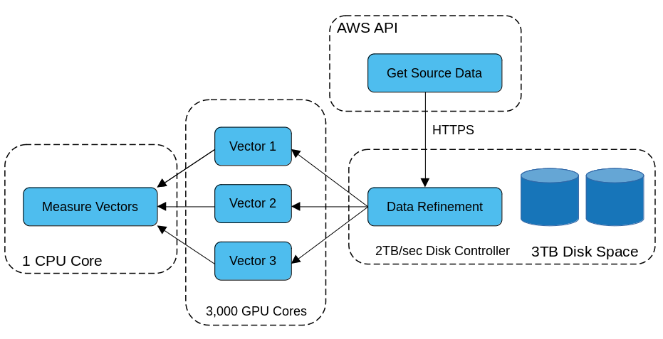
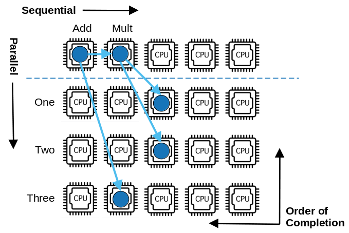

A lightweight native python parallel processing framework based on simple decorators and call graphs.

## Overview

Entangle is a *different* kind of parallel compute framework for multi-CPU environments. 
It allows for simple workflow design using *plain old python* and special decorators that control the type of parallel compute and infrastructure needed.

One key feature of entangle is fine-grained control over individual functions in a workflow. You could easily describe multiple functions running across multiple compute environments all interacting as if they were simple local python functions.
No central scheduler or workflow manager is needed.

Another unique quality is the use of composition to build dynamic, parallel workflows.

### What does "Entangle" mean?

The term is derived from a quantum physics phenomena called *[quantum entanglement](https://en.wikipedia.org/wiki/Quantum_entanglement#:~:text=Quantum%20entanglement%20is%20a%20physical,including%20when%20the%20particles%20are)* which involves the state of a pair or group of particles affecting one another *at a distance* instantaneously.

In this context, it is a metaphor for how tasks (particles) influence one another in the context of a connected microflow.
## Install

NOTE: At the moment entangle only works with python 3.7 or 3.8 due to how coroutines work in those versions.

From repo root

```shell

(venv) $ pip3 install pipenv
(venv) $ pipenv install --dev
(venv) $ pipenv run pytest

```

## Design Goals

* Small & Simple
* Easy to Understand
* non-API
* Plain Old Python
* True Parallelism
* Pluggable & Flexible
* Composition
* Shared-Nothing

## Architecture

Entangle is designed without a central scheduler or workflow manager. Rather, each function is decorated with special descriptors that turn them into their own workflow managers.
These *decorators* implement logic to parallelize and *gather* values from its dependent arguments, which are executed as separate processes. As each function is assigned a dedicated CPU, the workflow is thus an ensemble of parallel, independent micro-flows that resolve themselves and pass their values into queues until the workflow completes.

This offers an extreme *shared nothing* design that maximizes CPU usage in a multi-CPU environment.

Each function (or task) is given a process and scheduled to a CPU by the operating system. Since python Processes are native bound OS processes, this inherits the benefit of the operating system scheduler which is optimized for the underlying hardware.
Arguments that satisfy the function are run in parallel in the same fashion. The parent function then uses asyncio coroutines to monitor queues for the results from the processes. This keeps the CPU usage down while the dependent functions produce their results.

As a workflow executes, it fans out over CPUs. Each process acting as it's own scheduler to spawn new processes and resolve arguments, while also monitoring queues for incoming results asynchronously.
This makes the workflow a truly emergent, dynamic computing construct vs a monolithic service managing all the pieces. Of course, this is not to say one approach is better, just that entangle takes a different approach based on its preferred tradeoffs.


### Tradeoffs

Every design approach is a balance of tradeoffs. Entangle favors CPU utilization and *true* parallelism over resource managers, schedulers or other shared services.
It favors simplicity over behavior, attempting to be minimal and un-opinionated. It tries to be *invisible* to the end user as much as possible. It strives for the basic principle that, *"if it looks like it should work, it should work."*

Entangle leans on the OS scheduler to prioritize processes based on the behavior of those processes and underlying resource utilizations. It therefore does not provide its own redundant scheduler or task manager.

Entangle prefers the non-API approach, where it looks like regular python expressions, over strict API's or invocation idioms. This makes it easier to pick up and use and plays well with 3rd party frameworks too.
### Use Cases

Because of these tradeoffs, there are certain use cases that align with entangle and others that probably do not.

If you have lots of CPUs, entangle could be for you! If you want easy python workflows that span local and remote cloud resources, entangle could be for you.
If you want to write custom handlers that enrich or execute code in custom ways for your needs, entangle makes this easy for you.

Entangle benefits more with CPU intensive, longer running tasks than shorter, less CPU intensive tasks.

One focused use case for entangle is when you want to orchestrate across different compute nodes, remote APIs and other disparate endpoints in a single workflow.



Each step of the workflow has different parameters, needs and protocols used to communicate with it.
Such a workflow might simply look like:

```python
data = data_refinement(
    get_source_data()
)
result = measure_vectors(
    vector1(
        data("vector1")
    ),
    vector2(
        data("vector2")
    ),
    vector3(
        data("vector3")
    )
)
```

### Threads vs Processes

In Python, threads do not execute in parallel to one another, it only gives the illusion of such. Python handles the context switching between threads and is limited by the GIL.
Processes on the other hand, are not controlled by a GIL and can thus truly run in parallel. The host operating system governs the sheduling of processes and entangle is designed to exploit this benefit.

### What Entangle is not

* Entangle is not inherently distributed
* Entangle does not yet perform fail over or retries
* Entangle is not a batch process framework
* Entangle is not map/reduce
* Entangle is not a task manager

## Declarative Infrastructure

Entangle allows you to target specific infrastructure environments or needs using simple decorators.

For example, to specify a process run on local hardware you can use the @local decorator

```python
@process
@local
def myfunc():
    return
```

If you want to execute a function in AWS EC2 or fargate, you could write it as:

```python
@process
@aws(keys=[])
@ec2(ami='ami-12345')
def myfunc():
    return

@process
@aws(keys=[])
@fargate(ram='2GB', cpu='Xeon')
def myfunc():
    return
```

If you have a custom on-prem environment you can write a simple decorator that deploys the task to that and use it alongside other infrastructure decorators.
## Execution

As we mentioned above, entangle will fan out during execution and occupy CPUs throughout the workflow. The OS will determine the priority of processes based on their resource needs at the time of execution.
Here is a simple workflow and diagram showing how the parallel execution unfolds.

```python
result = add(
   mult(
      one(),
      two()
   ),
   three()
)
```


## Composition

Entangle offers a couple different ways to use composition effectively: with *decorators* and with *workflows*.
### Decorator Composition

You can compose your tasks by combining process and infrastructure decorators.

(Taken from above) Here we are declaring a *process* and *local* infrastructure for our task to run by composing two decorators together.
```python
@process
@local
def taskA():
    return
```
or, specifying that the task run as a process inside AWS fargate, unchanged.
```python
@process
@aws(keys=[])
@fargate(ram='2GB', cpu=4)
def taskA():
    return
```
### Workflow Composition
Composing workflows is just as simple. You can write code that itself constructs workflows on the fly easily.

```python
@workflow
def workflow1():
    return add(
        mydata(drilldowns='Nation', measures='Population'),
        two()
    )


@workflow
def workflow2(value):
    return add(
        value(),
        two()
    )


result = workflow2(
    workflow1
)
```

The key to making this work is the *deferring of execution* trait of Entangle which we will discuss in a later post.
But essentially it allows for separation of workflow *declaration* from *execution*. Doing this allows you to treat workflows as objects and pass them around anywhere a normal python function (or workflow) is expected. Prior to execution.

## Example
An example of how entangle will be used (still in development)
```python

from entangle.process import process
from entangle.thread import thread
from entangle.task import task
from entangle.local import local
from entangle.aws import ec2
from entangle.aws import lmbda
from entangle.http import request

@process(timeout=60)
@local(cpus=4)
def add(a, b):
    return a + b

@process(cache=True)
@aws(keys=[])
@ec2
def one():
    return 1

@thread
@local
def two():
    return 2

@lmbda(function='name')
@aws(keys=[])
def proxy():
    # lambda proxy
    pass

@process
def subtract(a, b):
    return int(a) - int(b)

@process
def five():
    return 5

@process
def num(n):
    return n

@process
@request(url='http://..../', method='POST')
def request(data):
    # Manipulate http response data here and return new result
    return data

# 1,2,3 get passed to lambda function and result returned
result = proxy(1,2,3)
# Pass key:value params and get result from your function
result = request(key1=value, key2=value )

# parallel workflow is just "plain old python"
result = add(
            add(
                num(6),
                two() if False else one()
            ),
            subtract(
                five(),
                two()
            )
        )

print(result())

```

## Design Tool

A prototype visual design tool for Entangle is shown below.


