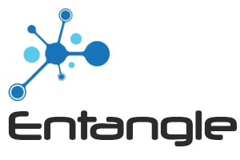
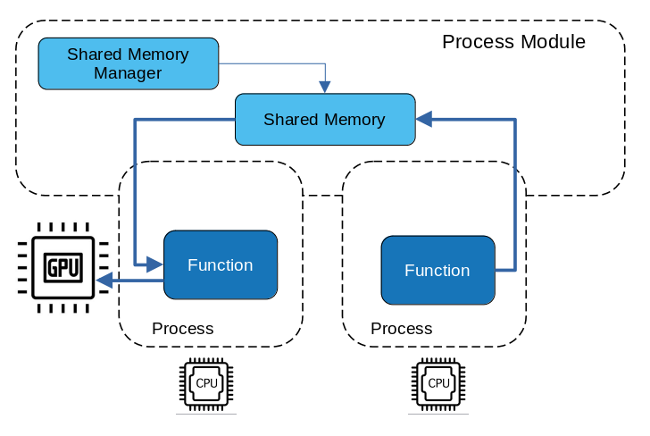
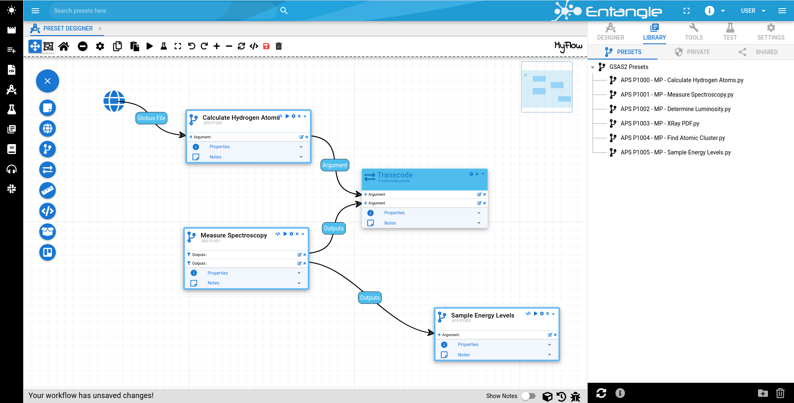

A lightweight (serverless) native python parallel processing framework based on simple decorators and call graphs.

## Quicklinks

* [Declarative Infrastructure](#declarative-infrastructure)
* [Workflow Composition](#workflow-composition)
* Examples  
    * [GPU Example](#gpu-example)
    * [Shared Memory Example](#shared-memory-example)
    * [AI Example](#ai-example)
    * [Docker Example](#docker-example)

## Overview

Entangle is a *different* kind of parallel compute framework for multi-CPU/GPU environments. 
It allows for simple workflow design using *plain old python* and special decorators that control the type of parallel compute and infrastructure needed.

One key feature of entangle is fine-grained control over individual functions in a workflow. You could easily describe multiple functions running across multiple compute environments all interacting as if they were simple local python functions.
No central scheduler or workflow manager is needed.

Another unique quality is the use of composition to build parallel workflows dynamically.

### What does "Entangle" mean?

The term is derived from a quantum physics phenomena called *[quantum entanglement](https://en.wikipedia.org/wiki/Quantum_entanglement#:~:text=Quantum%20entanglement%20is%20a%20physical,including%20when%20the%20particles%20are)* which involves the state of a pair or group of particles affecting one another *at a distance* instantaneously.

In this context, it is a metaphor for how tasks send data (particles) to one another in the context of a connected microflow.

### Important Notes

Please keep in mind that Entangle is *in development* and there are no releases as of yet. If you clone this repo and want to experiment be sure to update often as things break, improve, get fixed etc. quite frequently on the this branch for now.
## Install

NOTE: At the moment entangle only works with python 3.8 due to how coroutines work there and also shared memory features.

From repo root

```shell

(venv) $ pip3 install pipenv
(venv) $ pipenv install --dev
(venv) $ pipenv run pytest

```

## Design Goals

* Small & Simple
* Easy to Understand
* non-API
* Plain Old Python
* True Parallelism
* Pluggable & Flexible
* Composition
* Shared-Nothing
* Serverless & Threadless

## Architecture

Entangle is designed without a central scheduler or workflow manager. Rather, each function is decorated with special descriptors that turn them into their own workflow managers.
These *decorators* implement logic to parallelize and *gather* values from its dependent arguments, which are executed as separate processes. As each function is assigned a dedicated CPU, the workflow is thus an ensemble of parallel, independent micro-flows that resolve themselves and pass their values into queues until the workflow completes.

This offers an extreme *shared nothing* design that maximizes CPU usage in a multi-CPU environment.

Each function (or task) is given a process and scheduled to a CPU by the operating system. Since python Processes are native bound OS processes, this inherits the benefit of the operating system scheduler which is optimized for the underlying hardware.
Arguments that satisfy the function are run in parallel in the same fashion. The parent function then uses asyncio coroutines to monitor queues for the results from the processes. This keeps the CPU usage down while the dependent functions produce their results and eliminates the need for monitor threads.

As a workflow executes, it fans out over CPUs. Each process acting as it's own scheduler to spawn new processes and resolve arguments, while also monitoring queues for incoming results asynchronously.
This makes the workflow a truly emergent, dynamic computing construct vs a monolithic service managing all the pieces. Of course, this is not to say one approach is better, just that entangle takes a different approach based on its preferred tradeoffs.


### Tradeoffs

Every design approach is a balance of tradeoffs. Entangle favors CPU utilization and *true* parallelism over resource managers, schedulers or other shared services.
It favors simplicity over behavior, attempting to be minimal and un-opinionated. It tries to be *invisible* to the end user as much as possible. It strives for the basic principle that, *"if it looks like it should work, it should work."*

Entangle leans on the OS scheduler to prioritize processes based on the behavior of those processes and underlying resource utilizations. It therefore does not provide its own redundant scheduler or task manager. Because of this, top-down visibility or control of workflow processes is not as easy as with centralized task managers.

Entangle prefers the non-API approach, where it looks like regular python expressions, over strict API's or invocation idioms. This makes it easier to pick up and use and plays well with 3rd party frameworks too.
### Use Cases

Because of these tradeoffs, there are certain use cases that align with entangle and others that probably do not.

If you want top-down visibility & control of workflows and tasks, Entangle is probably not ready for you.

If you have lots of CPUs, entangle could be for you! If you want easy python workflows that span local and remote cloud resources, entangle could be for you.
If you want to write custom handlers that enrich or execute code in custom ways for your needs, entangle makes this easy for you.

Entangle benefits more with CPU intensive, longer running tasks than shorter, less CPU intensive tasks.

#### Orchestration
One focused use case for entangle is when you want to orchestrate across different compute nodes, remote APIs and other disparate endpoints in a single workflow, with inherent parallelism.


Each step of the workflow has different parameters, needs and protocols used to communicate with it.
Such a workflow might simply look like:

```python
data = data_refinement(
    get_source_data()
)
result = measure_vectors(
    vector1(
        data("vector1")
    ),
    vector2(
        data("vector2")
    ),
    vector3(
        data("vector3")
    )
)
```

#### GPU Processing
Another use case is the need to run multiple parallel tasks that operate on matrix data using a GPU.
Entangle makes this quite easy as seen in [GPU Example](#gpu-example), [Docker Example](#docker-example) and [Shared Memory Example](#shared-memory-example)

#### DevOps
For devops use cases Entangle allows you to write simple, parallel workflow graphs using *plain old python*. This let's you write efficient parallel devops pipelines with ease.


### What Entangle is not

* Entangle is not inherently distributed
* Entangle does not yet perform fail over or retries
* Entangle is not a batch process framework
* Entangle is not map/reduce
* Entangle is not a centralized task manager

## Declarative Infrastructure

Entangle allows you to target specific infrastructure environments or needs using simple decorators.

For example, to specify a process run on local hardware you can use the @local decorator

```python
@process
@local
def myfunc():
    return
```

If you want to execute a function in AWS EC2 or fargate, you could write it as:

```python
@process
@aws(keys=[])
@ec2(ami='ami-12345')
def myfunc():
    return

@process
@aws(keys=[])
@fargate(ram='2GB', cpu='Xeon')
def myfunc():
    return
```

or using docker containers
```python
@process
@docker(image="tensorflow/tensorflow:latest-gpu")
def reduce_sum():
    import tensorflow as tf
    return tf.reduce_sum(tf.random.normal([1000, 1000]))
```

If you have a custom on-prem environment you can write a simple decorator that deploys the task to that and use it alongside other infrastructure decorators.
## Execution

As we mentioned above, entangle will fan out during execution and occupy CPUs throughout the workflow. The OS will determine the priority of processes based on their resource needs at the time of execution.
Here is a simple workflow and diagram showing how the parallel execution unfolds.

```python
result = add(
   mult(
      one(),
      two()
   ),
   three()
)
```


### Threads vs Processes

In Python, threads do not execute in parallel to one another, it only gives the illusion of such. Python handles the context switching between threads and is limited by the GIL.
Processes on the other hand, are not controlled by a GIL and can thus truly run in parallel. The host operating system governs the sheduling of processes and entangle is designed to exploit this benefit.


## Process Behavior

Keyword parameters on the `@process` decorator allow you to control some meta-behavior of the process.

### Timeout

```python

# Wait at most, 3 seconds for this task to complete
@process(timeout=3)
def task():
    return True

# Wait indefinitely for this task to complete
@process
def taskB():
    return False
```
When a process times out, a `ProcessTimeoutException` will be thrown by Entangle and the process will be terminated if it is still alive.

## Composition

Entangle offers a couple different ways to use composition effectively: with *decorators* and with *workflows*.
### Decorator Composition

You can compose your tasks by combining process and infrastructure decorators.

Again, in the example below, we are declaring a *process* and *local* infrastructure for our task to run by composing two decorators together.
```python
@process
@local
def taskA():
    return
```
or, specifying that the task run as a process inside AWS fargate, unchanged.
```python
@process
@aws(keys=[])
@fargate(ram='2GB', cpu=4)
def taskA():
    return
```
### Workflow Composition
Composing workflows is just as simple. You can write code that itself constructs workflows on the fly easily.

```python
from entangle.process import process
from entangle.http import request
from entangle.workflow import workflow


@process
@request(url='https://datausa.io/api/data', method='GET')
def mydata(data):
    import json
    data = json.loads(data)
    return int(data['data'][0]['Year'])


@process
def two():
    return 2


@process
def add(a, b):
    v = int(a) + int(b)
    print("ADD: *"+str(v)+"*")
    return v


@workflow
def workflow1():
    return add(
        mydata(drilldowns='Nation', measures='Population'),
        two()
    )


@workflow
def workflow2(value):
    return add(
        value(),
        two()
    )


result = workflow2(workflow1)

print(result())

```

The key to making this work is the *deferring of execution* trait of Entangle which we will discuss in a later post.
But essentially it allows for separation of workflow *declaration* from *execution*. Doing this allows you to treat workflows as objects and pass them around anywhere a normal python function (or workflow) is expected. Prior to execution.

## Containers

TBD
## Examples

* [GPU Example](#gpu-example)
* [Shared Memory Example](#shared-memory-example)
* [AI Example](#ai-example)
* [Docker Example](#docker-example)
* [General Example](#general-example)

### GPU Example
This example assumes you have installed `nvidia-cuda-toolkit` and associated python packages along with `numba`.

In this example, two vectorized functions with different sized matrices are run in parallel, and their times are gathered.
```python
import numpy as np
from entangle.process import process
from timeit import default_timer as timer
from numba import vectorize


@process
def dovectors1():

    @vectorize(['float32(float32, float32)'], target='cuda')
    def pow(a, b):
        return a ** b

    vec_size = 100

    a = b = np.array(np.random.sample(vec_size), dtype=np.float32)
    c = np.zeros(vec_size, dtype=np.float32)

    start = timer()
    pow(a, b)
    duration = timer() - start
    return duration


@process
def dovectors2():

    @vectorize(['float32(float32, float32)'], target='cuda')
    def pow(a, b):
        return a ** b

    vec_size = 100000000

    a = b = np.array(np.random.sample(vec_size), dtype=np.float32)
    c = np.zeros(vec_size, dtype=np.float32)

    start = timer()
    pow(a, b)
    duration = timer() - start
    return duration


@process
def durations(*args):

    times = [arg for arg in args]

    return times


dp = durations(
    dovectors1(),
    dovectors2()
)

print(dp())

```
Which outputs something like
```python
[0.21504536108113825, 0.3445616390090436]
```

### Shared Memory Example

The default return value conduit in Entangle is the Queue. Task return values are marshalled back through queues where they are gathered and provided as function parameters to the parent process task.
This method is not desirable for very large data sets such as matrices in GPU computations. The below example shows how Entangle uses python 3.8's shared memory feature to implicitly share volatile memory across native parallel processes.



```python
import numpy as np
from entangle.process import process
from timeit import default_timer as timer
from numba import vectorize


@process(shared_memory=True)
def dopow(names, smm=None, sm=None):
    (namea, nameb, shapea, shapeb, typea, typeb) = names

    start = timer()
    shma = sm(namea)
    shmb = sm(nameb)

    
    # Get matrixes from shared memory
    np_shma = np.frombuffer(shma.buf, dtype=typea)
    np_shmb = np.frombuffer(shmb.buf, dtype=typeb)

    @vectorize(['float32(float32, float32)'], target='cuda')
    def pow(a, b):
        return a ** b

    pow(np_shma, np_shmb)
    duration = timer() - start
    print("Powers Time: ", duration)


@process(shared_memory=True)
def createvectors(smm=None, sm=None):

    vec_size = 100000000

    start = timer()
    a = b = np.array(np.random.sample(vec_size), dtype=np.float32)
    c = np.zeros(vec_size, dtype=np.float32)

    # create shared memory for matrices
    shma = smm.SharedMemory(a.nbytes)
    shmb = smm.SharedMemory(b.nbytes)

    names = (shma.name, shmb.name, a.shape, b.shape, a.dtype, b.dtype)

    duration = timer() - start
    print("Create Vectors Time: ", duration)
    return names


dp = dopow(
    createvectors()
)

dp()
```

Outputs

```bash
Create Vectors Time:  0.8577492530457675
Powers Time:  0.8135421359911561
```

#### SharedMemoryManager & SharedMemory

In the example above, you will notice two special keywords being passed into the functions, 

`def createvectors(smm=None, sm=None):`

`smm` is a handle to the `SharedMemoryManager` being used for this workflow and `sm` is a handle to the `SharedMemory` class needed to acquire the shared memory segments by name.
If you set `shared_memory=True` then you *must* include these keyword arguments in your method or an error will occur.


---

Now, you might be asking yourself, if one of the design goals was *shared-nothing* then why are we talking about *shared memory*?
When we say "shared" (in shared-nothing) we refer to resources that have to be synchronized or locked when accessed by parallel processes, thereby creating bottlenecks in the execution.
The shared memory example here does not introduce any contention, rather, it is used in a pipeline fashion.
In this approach, a given shared memory address is only updated by one process at a time (e.g. using it to return its data to the waiting process). Multiple shared memory segments can be created during the course of a workflow
for parallel running processes.


### AI Example
Here is an example that uses tensorflow to train a model and return the summary.
```python
from entangle.docker import docker
from entangle.process import process

import logging
logging.basicConfig(
    format='%(asctime)s : %(levelname)s : %(message)s', level=logging.DEBUG)

@process
@docker(image="tensorflow/tensorflow:latest-gpu", packages=['tensorflow_datasets'])
def train():
    import tensorflow as tf
    import tensorflow_datasets as tfds

    (ds_train, ds_test), ds_info = tfds.load(
        'mnist',
        split=['train', 'test'],
        shuffle_files=True,
        as_supervised=True,
        with_info=True,
    )

    def normalize_img(image, label):
        return tf.cast(image, tf.float32) / 255., label

    ds_train = ds_train.map(
        normalize_img, num_parallel_calls=tf.data.experimental.AUTOTUNE)
    ds_train = ds_train.cache()
    ds_train = ds_train.shuffle(ds_info.splits['train'].num_examples)
    ds_train = ds_train.batch(128)
    ds_train = ds_train.prefetch(tf.data.experimental.AUTOTUNE)

    ds_test = ds_test.map(
        normalize_img, num_parallel_calls=tf.data.experimental.AUTOTUNE)
    ds_test = ds_test.batch(128)
    ds_test = ds_test.cache()
    ds_test = ds_test.prefetch(tf.data.experimental.AUTOTUNE)

    model = tf.keras.models.Sequential([
        tf.keras.layers.Flatten(input_shape=(28, 28)),
        tf.keras.layers.Dense(128, activation='relu'),
        tf.keras.layers.Dense(10)
    ])

    model.compile(
        optimizer=tf.keras.optimizers.Adam(0.001),
        loss=tf.keras.losses.SparseCategoricalCrossentropy(from_logits=True),
        metrics=[tf.keras.metrics.SparseCategoricalAccuracy()],
    )

    model.fit(
        ds_train,
        epochs=6,
        verbose=0,
        validation_data=ds_test,
    )

    return model.summary()


model = train()
print(model())

```

### Docker Example
In this example we are running a process that spawns the decorated function inside a docker container and waits for the result.
We compose this using the `@process` and `@docker` decorators to achieve the design. The function `reduce_sum` is run *inside* the docker container using image `tensorflow/tensorflow:latest-gpu` and the result is returned seamlessly to the workflow.
```python
from entangle.docker import docker
from entangle.process import process

import logging
logging.basicConfig(
    format='%(asctime)s : %(levelname)s : %(message)s', level=logging.INFO)


@process
@docker(image="tensorflow/tensorflow:latest-gpu")
def reduce_sum():
    import tensorflow as tf
    return tf.reduce_sum(tf.random.normal([1000, 1000]))

rs = reduce_sum()
print(rs())

```


### General Example
An example of how entangle will be used (still in development)
```python

from entangle.process import process
from entangle.thread import thread
from entangle.task import task
from entangle.local import local
from entangle.aws import ec2
from entangle.aws import lmbda
from entangle.http import request

@process(timeout=60)
@local(cpus=4)
def add(a, b):
    return a + b

@process(cache=True)
@aws(keys=[])
@ec2
def one():
    return 1

@thread
@local
def two():
    return 2

@lmbda(function='name')
@aws(keys=[])
def proxy():
    # lambda proxy
    pass

@process
def subtract(a, b):
    return int(a) - int(b)

@process
def five():
    return 5

@process
def num(n):
    return n

@process
@request(url='http://..../', method='POST')
def request(data):
    # Manipulate http response data here and return new result
    return data

# 1,2,3 get passed to lambda function and result returned
result = proxy(1,2,3)
# Pass key:value params and get result from your function
result = request(key1=value, key2=value )

# parallel workflow is just "plain old python"
result = add(
            add(
                num(6),
                two() if False else one()
            ),
            subtract(
                five(),
                two()
            )
        )

print(result())

```

## Design Tool

A prototype visual design tool for Entangle is shown below.


